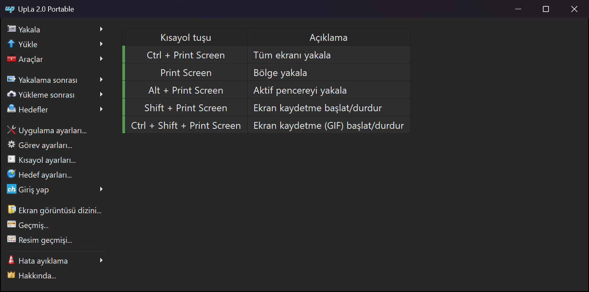
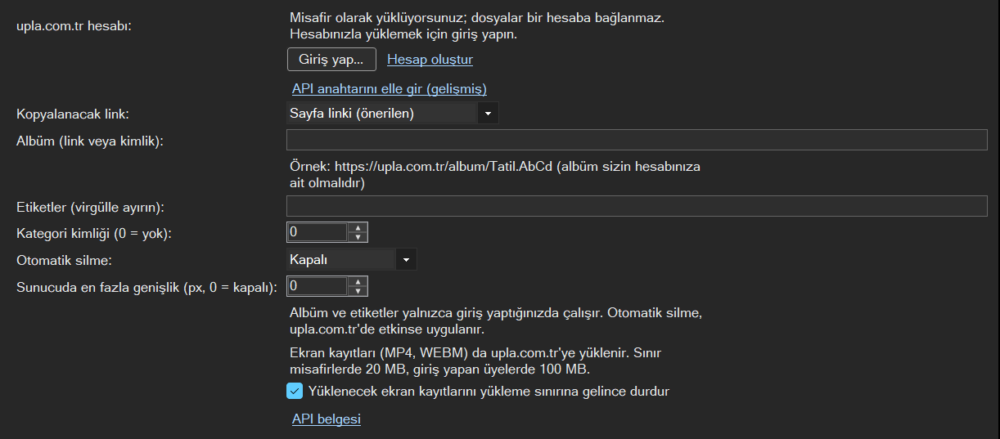
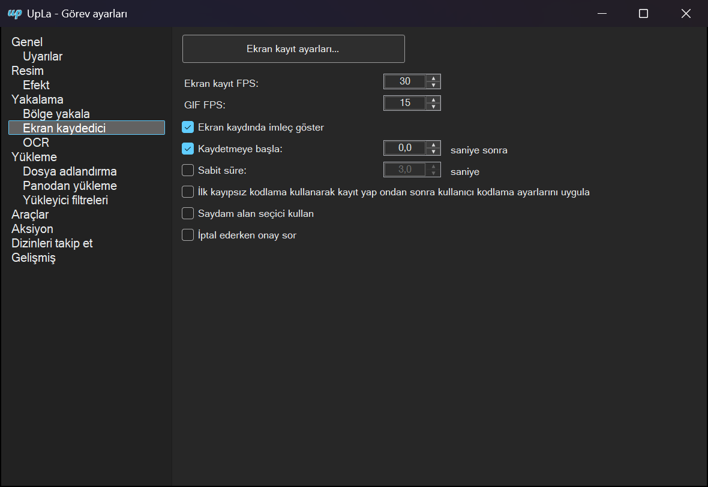

# UpLa

UpLa is the Windows desktop app of [upla.com.tr](https://upla.com.tr), a free image and video host. It takes
screenshots and screen recordings and uploads them, or any image or video file, to upla.com.tr. Uploads work as a
guest without an account; members can sign in from the app to upload to their own account.

UpLa is based on [ShareX](https://github.com/ShareX/ShareX) by the ShareX Team and is licensed under the
[GNU General Public License v3](LICENSE.txt). It is not an official ShareX release.

**Türkçe:** UpLa, ücretsiz resim ve video barındırma sitesi [upla.com.tr](https://upla.com.tr)'nin Windows
uygulamasıdır. Ekran görüntüsü ve ekran kaydı alır, bunları ya da bilgisayardaki resim ve videoları upla.com.tr'ye
yükler. Hesap olmadan misafir olarak kullanılabilir; üyeler uygulamadan giriş yaparak kendi hesaplarına yükler.
ShareX tabanlıdır ve GPL v3 ile lisanslanmıştır. [Microsoft Store'dan](https://apps.microsoft.com/detail/9pphtn74p3cn)
uyarı çıkmadan kurulur ve güncellemelerini Store'dan alır.

## Screenshots

The main window with the capture hotkeys (Turkish interface):



upla.com.tr settings: signing in, the link to copy, album, tags, auto delete and the screen recording limit:



Screen recorder settings:



## Download

<a href="https://apps.microsoft.com/detail/9pphtn74p3cn?mode=direct"></a>

The recommended way to install UpLa is the [Microsoft Store](https://apps.microsoft.com/detail/9pphtn74p3cn). Microsoft
signs the Store version, so it installs without warnings, and it gets its updates from the Store. Requirements: Windows
10 1903 or later, x64 or ARM64.

The setup and portable builds are also published on the [releases page](https://github.com/Agnostique/UpLa/releases)
and linked from [upla.com.tr](https://upla.com.tr/page/ekran-goruntusu). The latest setup is always at
<https://github.com/Agnostique/UpLa/releases/latest/download/UpLa-setup-x64.exe>. Requirements: Windows 10 1607 or
later, 64-bit.

The GitHub builds are not code signed, so Windows may show "Windows protected your PC" when the setup is started for
the first time ("More info" > "Run anyway"), and PCs with Smart App Control turned on do not run them. All builds,
including the Store packages, are made by GitHub Actions from this repository.

## How UpLa differs from ShareX

- Uploads go only to upla.com.tr: guest uploads, signing in with a username or email and password (with two-step
  verification), and keys entered by hand. All other upload destinations, URL shorteners and custom uploaders were
  removed.
- Tools that are not about capturing and uploading were removed. Capture, screen recording, the image editor, image
  effects, pin to screen, OCR and the history are kept.
- Screen recordings that will be uploaded stop at the upload limit (20 MB for guests, 100 MB for members), so they
  fit it. This can be turned off in the upla.com.tr settings.
- No telemetry. Updates come from this repository's releases: UpLa checks for a newer release once a day.
- Settings of UpLa 1.0 (in `Documents\UpLa`) are taken over.

## Privacy

UpLa does not send any information to other computers unless you ask it to:

- Files are sent only when you upload them (or capture with "upload after capture" turned on), and only to
  upla.com.tr.
- Signing in sends your username or email and password to upla.com.tr over HTTPS. The password is never stored; the
  app keeps a key for this computer, encrypted for your Windows account. The computer name is shown to you on the
  website's "Connected devices" page.
- Screen recording needs FFmpeg. If it is missing when you start a recording, UpLa downloads it once from
  [GitHub](https://github.com/ShareX/FFmpeg/releases) and uses it only if its SHA-256 matches the expected value.
- Once a day UpLa asks GitHub (api.github.com) whether a newer UpLa release exists; GitHub sees your IP address. If
  you accept an update, the setup is downloaded from GitHub and installed only when its SHA-256 matches the one GitHub
  lists for it. "Automatically check for updates" in the application settings turns this off; the Microsoft Store
  version gets its updates from the Store.
- There is no telemetry.

## Building

Requirements: Windows 10 1607 or later, the .NET 10 SDK.

```
dotnet build --configuration Release -p:Platform=x64 --self-contained true -m:1 ShareX.sln
```

The app is built to `ShareX\bin\Release\win-x64\UpLa.exe`. Project and namespace names keep the ShareX names, which
makes it easier to take changes from ShareX.

Release and Microsoft Store builds need the upla.com.tr guest upload key, which is not in the repository. Create
`ShareX.UploadersLib\APIKeys\APIKeysLocal.cs` (it is git ignored):

```csharp
namespace ShareX.UploadersLib
{
    internal static partial class APIKeys
    {
        static APIKeys()
        {
            UplaAPIKey = "...";
        }
    }
}
```

Debug builds work without it, but guest uploads fail. On GitHub Actions the file comes from the `API_KEYS_LOCAL`
secret.

The installer is built by `ShareX.Setup` with [Inno Setup 6](https://jrsoftware.org/isinfo.php). It downloads the
FFmpeg build that screen recording uses and writes `Output\UpLa-<version>-setup-<platform>.exe`.

The Microsoft Store package is built with the `MicrosoftStore` configuration and `ShareX.Setup -job MicrosoftStore`,
which needs the Windows SDK (makeappx and makepri) and writes `Output\UpLa-<version>-MicrosoftStore-<platform>.msix`.
FFmpeg is inside the package, and the Store build leaves out what a packaged app cannot do (Explorer menus, installing
the recorder devices, downloading FFmpeg). The package identity in `ShareX.Setup\MicrosoftStore\AppxManifest.xml`
must match the app's Partner Center product identity.

## Server add-on

Signing in from the app uses a small route for Chevereto 4.5 on upla.com.tr. Its source and setup notes are in
[Server](Server/README.md).

## License

UpLa is free software under the [GNU General Public License v3](LICENSE.txt).
Copyright (c) 2007-2026 ShareX Team and the UpLa contributors (upla.com.tr).
Third-party licenses are in [Licenses](Licenses).
